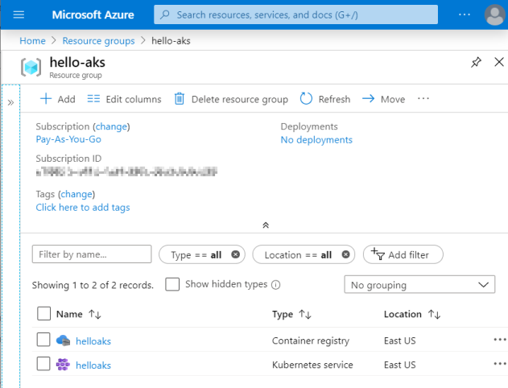

# Prerequisites

## Azure location

For Azure locations, typically `eastus` or `northeurope` will be lowest price. List locations using

```console
az account list-locations
```

Check pricing with the [Azure Pricing Calculator](https://azure.microsoft.com/en-us/pricing/calculator/?service=kubernetes-service).

## Create resources

Assuming `eastus`, now create resources using

```bash
# 1. Create resource group
az group create -n hello-aks -l eastus
# 2. Create container registry
az acr create -n helloaks -g hello-aks -l eastus --sku Basic
az acr login -n helloaks
# 3. Create AKS cluster
# az aks get-versions -l eastus ---> latest version: 1.17.0
az aks create -g hello-aks -l eastus -n helloaks -k 1.17.0 --generate-ssh-keys
# 4. To finally cleanup
#az group delete hello-aks
```

and check your resources in Azure portal [/resourceGroups/hello-aks/overview](https://portal.azure.com/#@<login>/resource/subscriptions/<subscription>/resourceGroups/hello-aks/overview)



## Azure Dev Spaces

To enable [Azure Dev spaces](https://docs.microsoft.com/bs-latn-ba/azure/dev-spaces/) do

```bash
az aks use-dev-spaces -g hello-aks -n helloaks
```

## Cluster scaling

To [Scale the node count in an Azure Kubernetes Service (AKS) cluster](https://docs.microsoft.com/en-us/azure/aks/scale-cluster)

```bash
# Get node pool profiles
$az aks show -g hello-aks -n helloaks --query agentPoolProfiles
[
  {
    "availabilityZones": null,
    "count": 3,
    "enableAutoScaling": null,
    "enableNodePublicIp": null,
    "maxCount": null,
    "maxPods": 110,
    "minCount": null,
    "name": "nodepool1",
    "nodeTaints": null,
    "orchestratorVersion": "1.17.0",
    "osDiskSizeGb": 100,
    "osType": "Linux",
    "provisioningState": "Succeeded",
    "scaleSetEvictionPolicy": null,
    "scaleSetPriority": null,
    "type": "VirtualMachineScaleSets",
    "vmSize": "Standard_DS2_v2"
  }
]
```

## `kubectl`

Get `kubectl` config and ensure you are talking to the newly created k8s cluster

```bash
$az aks get-credentials -n helloaks -g hello-aks
Merged "helloaks" as current context in ~/.kubeconfig

$kubectl config use-context helloaks
Switched to context "helloaks".

$kubectl config current-context
helloaks
```

Next, create a namespace

```bash
$kubectl create namespace phippyandfriends
namespace/phippyandfriends created
```

## Install Draft

**Note:** As of now, `draft` does not _helm without tiller_ [Azure/draft/issues/944](https://github.com/Azure/draft/issues/944). So either install draft & tiller (helm 2) or use pure helm instead

This tutorial uses [Draft](https://draft.sh/) to accomodate developer workflow so be sure to have it installed up-front, e.g. for Windows you would use Chocolatey to install [packages/draft](https://chocolatey.org/packages/draft)

```bash
cinst -y draft
# 1. Initialize
draft init
# 2. Connect to Azure Container Registry
draft config set registry helloaks.azurecr.io
az acr login -n helloaks
```

Now, continue in [README/Deploy Parrot and Captain Kube with Draft and Helm](../README.md#deploy-parrot-and-captain-kube-with-draft-and-helm)

## References

See also:

- [Tutorial: Using Azure DevOps to setup a CI/CD pipeline and deploy to Kubernetes](https://cloudblogs.microsoft.com/opensource/2018/11/27/tutorial-azure-devops-setup-cicd-pipeline-kubernetes-docker-helm/)
- [AKS: Quickly switching context between multiple clusters in Azure Kubernetes Services with cmder aliases](https://zimmergren.net/switch-context-multiple-kubernetes-clusters-aks-azure/)
- k8s documentation [Get Started With The Azure Kubernetes Service (AKS)](https://docs.bitnami.com/azure/get-started-aks/)
- [Quickstart: Team development on Kubernetes - Azure Dev Spaces](https://docs.microsoft.com/en-us/azure/dev-spaces/quickstart-team-development)
- [kubectl Cheat Sheet](https://kubernetes.io/docs/reference/kubectl/cheatsheet/)
